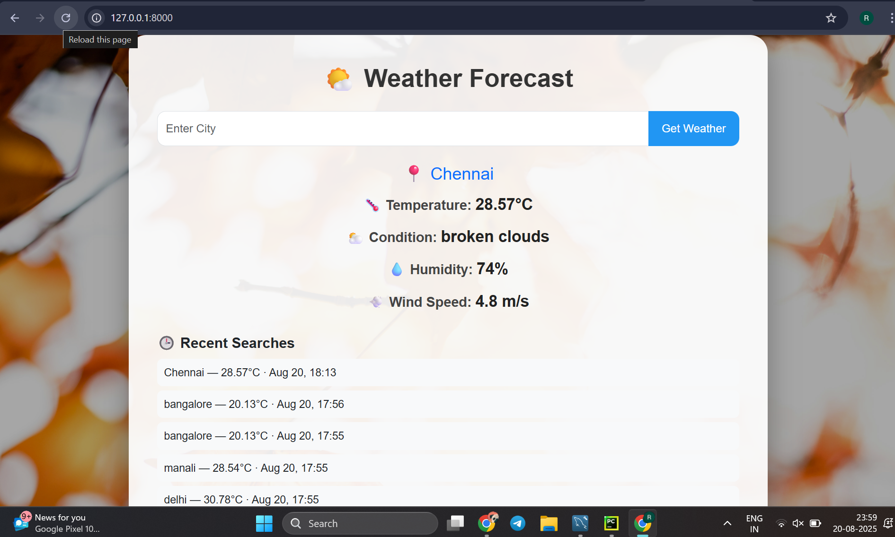
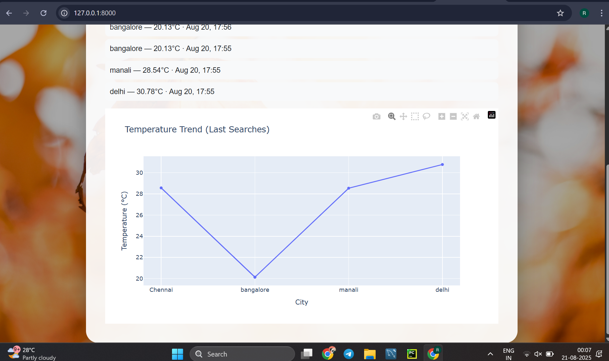

🌦️ Weather Forecast Web App

A Django-based weather forecasting application that allows users to search for a city and view current weather details, along with recent searches. Data is fetched from the OpenWeather API and stored in a database for persistence.

🚀 Features

Search weather by city name

Shows temperature, humidity, wind speed, and conditions with icons

Stores last 5 searched cities

Displays results with attractive UI (background + styled cards)

Charts for daily/hourly weather trends using Plotly

Backend: Django + REST API integration

🛠️ Tech Stack

Python 3.11

Django 5

MySQL (configured as database)

Plotly (for charts & graphs)

HTML, CSS, Bootstrap/Tailwind for frontend
## 📸 Screenshots

### Home Page  

### Weather Chart  

⚙️ Installation & Setup

Clone the repo

git clone https://github.com/RJaasmitha/weather-forecast-app.git
cd weather-forecast-app

Create a virtual environment

python -m venv venv
source venv/bin/activate   # Mac/Linux
venv\Scripts\activate      # Windows

Install dependencies

pip install -r requirements.txt

Setup database (MySQL)

Create a database in MySQL (example: weather_db)

Update settings.py with your DB credentials:

DATABASES = {
    'default': {
        'ENGINE': 'django.db.backends.mysql',
        'NAME': 'weather_db',
        'USER': 'root',
        'PASSWORD': 'yourpassword',
        'HOST': 'localhost',
        'PORT': '3306',
    }
}

Run migrations:

python manage.py migrate

Run the server

python manage.py runserver

Open in browser:
👉 http://127.0.0.1:8000/
